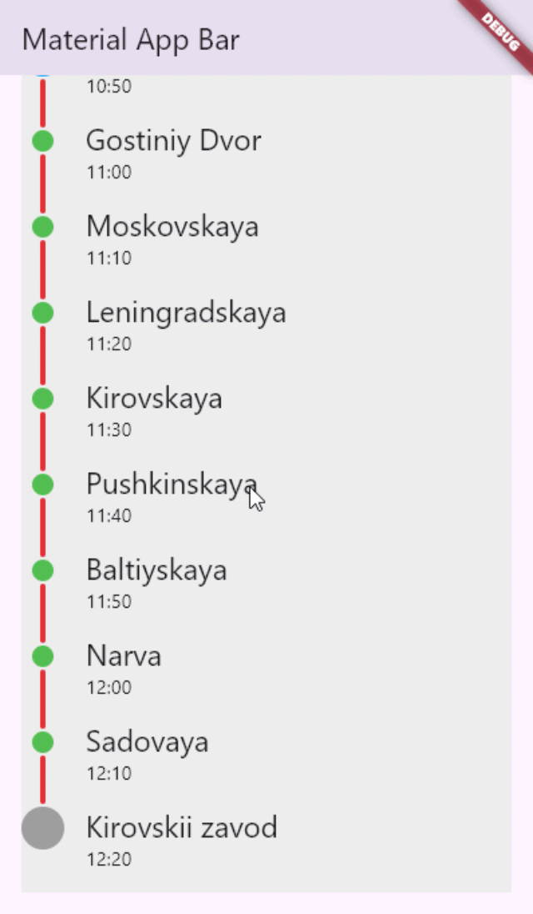

# Sandbox

This repository serves as a sandbox for various simple widgets and experimental projects in Flutter. The goal is to explore different aspects of the Flutter framework by creating small, self-contained examples.

## Custom Stepper Widget
A custom `Stepper` widget, which demonstrates custom layout, painting and interaction using `RenderObject`.

