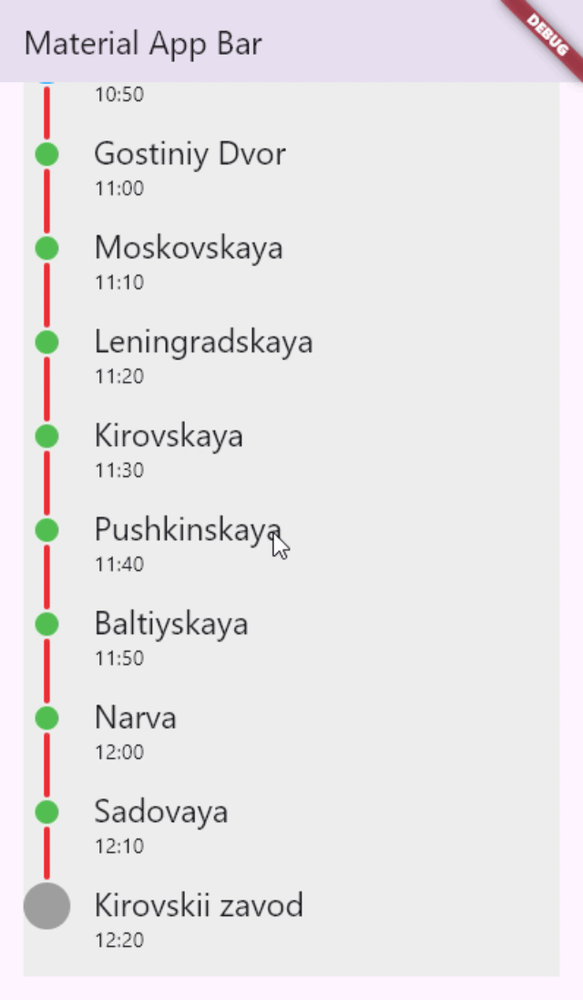

# Sandbox

This repository serves as a sandbox for various simple widgets and experimental projects in Flutter. The goal is to explore different aspects of the Flutter framework by creating small, self-contained examples.

## Custom Stepper Widget
A custom `Stepper` widget, which demonstrates custom layout, painting and interaction using `RenderObject`.

## Bounce Ball Widget
A bouncing ball widget that showcases physics simulation, custom painting, and animation.
Performs well even with a large number of particles.

## Three State App Bar
A three-state app bar that changes its appearance based on the scroll position of a `SliverList`. It uses a `SliverPositionNotifier` to track the scroll position and update the app bar's color dynamically. 

